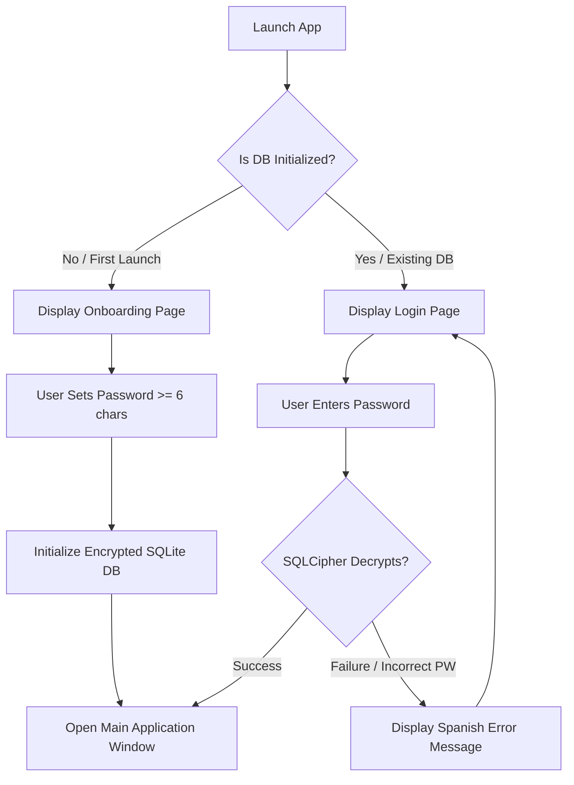

# SPEC-01: App Initialization, Authentication, and Encrypted Database

## Metadata
- **Status**: Draft
- **Author**: Spec Author (The Architect)
- **Created Date**: 2026-06-30
- **Last Updated**: 2026-06-30

---

## 1. Objectives & Scope

### 1.1 Summary
This specification outlines the startup lifecycle of the MinistryShift desktop application. It defines the onboarding flow (creating a master password of at least 6 characters on first launch), subsequent authentication (login to unlock the application), and the setup of a secure, local-first SQLite database encrypted with SQLCipher via Drift.

### 1.2 Out of Scope
- Multi-user accounts (the application operates with a single global database).
- Password recovery via external servers (all authentication is local; if the password is lost, the data is unrecoverable).
- Cloud synchronization of the database or master password.

---

## 2. Functional Requirements

### 2.1 User Stories & Use Cases
- **User Story 1 (First Launch)**: As a user opening the app for the first time, I want to set a secure password of at least 6 characters to encrypt my data so that unauthorized persons cannot access my ministry information.
- **User Story 2 (Subsequent Launches)**: As a returning user, I want to enter my password to unlock the application and access my records securely.
- **User Story 3 (Failed Authentication)**: As a user entering an incorrect password, I want to see a clear Spanish error message, and the application must remain locked.

### 2.2 Functional Specifications


#### 2.2.1 Initialization & Password Constraints
- Upon launch, the app determines if a local database file exists in the standard app data directory:
  - Windows: `%APPDATA%/MinistryShift/database.sqlite` (or equivalent sandboxed path).
  - macOS: `~/Library/Application Support/MinistryShift/database.sqlite`.
- If the database file does **not** exist, the app goes into the **Onboarding State**.
- **Password validation rules**:
  - Minimum length: 6 characters.
  - No leading/trailing spaces.
  - The UI must require double entry (Password and Confirm Password) to prevent typos.
- If the database file **does** exist, the app goes into the **Login State**.

#### 2.2.2 Decryption Validation
- Entering a password triggers Drift to open the SQLite file using SQLCipher with the provided password.
- To verify the password without causing runtime crashes, a test query is executed immediately upon connection (e.g., selecting from `sqlite_schema` or a configuration table).
- If the key is incorrect, SQLCipher will throw a database error (typically code 26: `SQLITE_NOTADB` or decryption failure). The app must catch this, clear password fields, and notify the user.

### 2.3 User Interface (UI) Strings (Spanish Translation Mapping)
The default UI is Spanish (`es_ES`). The translation mappings for this module are:

| English Key | Spanish UI Translation (es_ES) | Notes / Context |
| :--- | :--- | :--- |
| `auth_onboarding_title` | `Configurar Contraseña de Seguridad` | Title of the onboarding screen |
| `auth_onboarding_subtitle` | `Esta contraseña cifrará de forma segura todos tus datos locales de predicación.` | Explanation text |
| `auth_password_label` | `Contraseña` | Form input label |
| `auth_password_confirm_label` | `Confirmar Contraseña` | Form input label for verification |
| `auth_password_min_length_error` | `La contraseña debe tener al menos 6 caracteres.` | Input validation message |
| `auth_passwords_mismatch_error` | `Las contraseñas no coinciden.` | Input validation message |
| `auth_submit_button` | `Iniciar Aplicación` | Button label to submit password |
| `auth_login_title` | `Iniciar Sesión` | Title of the login screen |
| `auth_login_subtitle` | `Introduce tu contraseña para desbloquear MinistryShift.` | Explanation text for login |
| `auth_invalid_password_error` | `Contraseña incorrecta. Inténtalo de nuevo.` | Database decryption failure error |
| `auth_generic_db_error` | `Error al abrir la base de datos. Póngase en contacto con soporte.` | Generic error message |

---

## 3. Data Models & Database Schemas

### 3.1 Encryption Flow (SQLCipher Integration)
The password is fed directly to SQLCipher during connection.
- Drift utilizes `drift_sqflite` (or `drift` with `sqlite3` bindings using SQLCipher binary binaries).
- On SQLite initialization, we invoke:
  ```sql
  PRAGMA key = 'user_password_here';
  ```
  *(Note: Drift handles this automatically if configuring the Sqlite3 database connection with password options).*

### 3.2 System Table (Drift / SQL)
To guarantee schema integrity and verify password correctness, the database contains a system metadata table:

```dart
// Drift representation in English
class SystemMetadata extends Table {
  TextColumn get key => text().withLength(min: 1, max: 50)();
  TextColumn get value => text().withLength(min: 1, max: 255)();

  @override
  Set<Column> get primaryKey => {key};
}
```

During initialization:
- On first database creation, the table `SystemMetadata` is created, and a verification entry is inserted:
  - Key: `encryption_validation_token`
  - Value: `MinistryShiftSecureToken`
- On login, the app queries:
  ```sql
  SELECT value FROM system_metadata WHERE key = 'encryption_validation_token';
  ```
  If this query returns `MinistryShiftSecureToken`, authentication is successful. If it throws a database decryption error, the password was incorrect.

---

## 4. Test / Harness Plan

### 4.1 Test Harness Structure
- We will construct a database test harness `DatabaseTestHarness` in Dart.
- Since we use SQLCipher, the test harness must be capable of running tests against an in-memory SQLite database initialized with encryption, as well as temporary file-based databases to verify file persistence and password rejection.

### 4.2 Test Scenarios (Unit & Integration)
- **Scenario 1 (Fresh Launch)**:
  - Run DB harness without an existing file.
  - Attempt database creation with a password under 6 characters -> Verify validation exception is thrown.
  - Attempt database creation with password `MySecurePassword123` -> Verify database file is created, and validation token is correctly written.
- **Scenario 2 (Access Granted)**:
  - Initialize database file with `MySecurePassword123`.
  - Re-open database with `MySecurePassword123` -> Verify metadata query returns `MinistryShiftSecureToken` and no errors are thrown.
- **Scenario 3 (Access Denied / Incorrect Password)**:
  - Initialize database file with `MySecurePassword123`.
  - Attempt to open the database file with `WrongPassword456` -> Verify Drift/SQLCipher throws a database decryption error (e.g., `SqliteException` with error code 26 / file not a database).
- **Scenario 4 (Sanitization Check)**:
  - Attempt to pass a password with SQL characters (e.g. `' OR '1'='1`) -> Verify SQLCipher safely treats it as a literal string key and does not execute it as SQL code.

---

## 5. Security, Performance & System Constraints

### 5.1 Security Controls
- **Memory Sanitation**: Ensure that password characters inside Dart strings are cleared from memory when no longer needed (e.g. overwriting UI controllers as soon as connection is verified).
- **Prepared Queries**: All application-level queries are generated through Drift's type-safe, compiled API, which enforces parameterized queries implicitly. No raw string concatenation for SQL is permitted.
- **Password Strength**: While length is constrained to `>= 6`, the UI should encourage passwords that include numbers or mixed-case to resist brute force.

### 5.2 Performance & Memory
- Since SQLCipher uses key derivation functions (typically PBKDF2 with multiple iterations), opening the database takes a brief fraction of a second. The UI must show a loading spinner during validation so the application does not appear frozen.
- Database access should run in a separate isolate or asynchronously to keep the main UI thread at 60/120 FPS.
