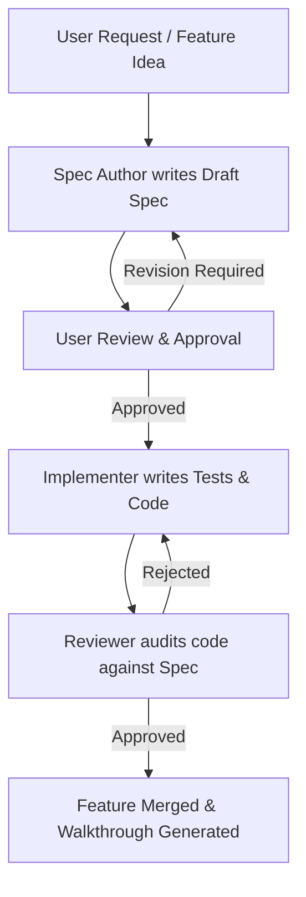

# MinistryShift Specifications

Welcome to the specifications folder of MinistryShift. This project uses **Spec-Driven Development (SDD)**. No implementation code can be written without a corresponding approved specification file here.

## Spec-Driven Development Workflow

## Specifications Index

- **[00_template.md](file:///C:/Users/polca/Downloads/MinistryShift/specs/00_template.md)**: Standard template for all feature specifications.
- **[01_auth_and_database.md](file:///C:/Users/polca/Downloads/MinistryShift/specs/01_auth_and_database.md)**: App Initialization, Authentication, and Encrypted Database.
- **[02_git_ci_cd.md](file:///C:/Users/polca/Downloads/MinistryShift/specs/02_git_ci_cd.md)**: Version Control, Packaging, and CI/CD Pipeline.
- **[03_backups_and_updates.md](file:///C:/Users/polca/Downloads/MinistryShift/specs/03_backups_and_updates.md)**: Encrypted Backups and Auto-Updates.
- **[04_domain_models.md](file:///C:/Users/polca/Downloads/MinistryShift/specs/04_domain_models.md)**: Domain Models, Database Schema, and Calendar Views.
- **[05_scheduler_and_substitution.md](file:///C:/Users/polca/Downloads/MinistryShift/specs/05_scheduler_and_substitution.md)**: Scheduler and Substitution Engine.
- **[06_pdf_exporter.md](file:///C:/Users/polca/Downloads/MinistryShift/specs/06_pdf_exporter.md)**: Monthly Schedule PDF Exporter.

